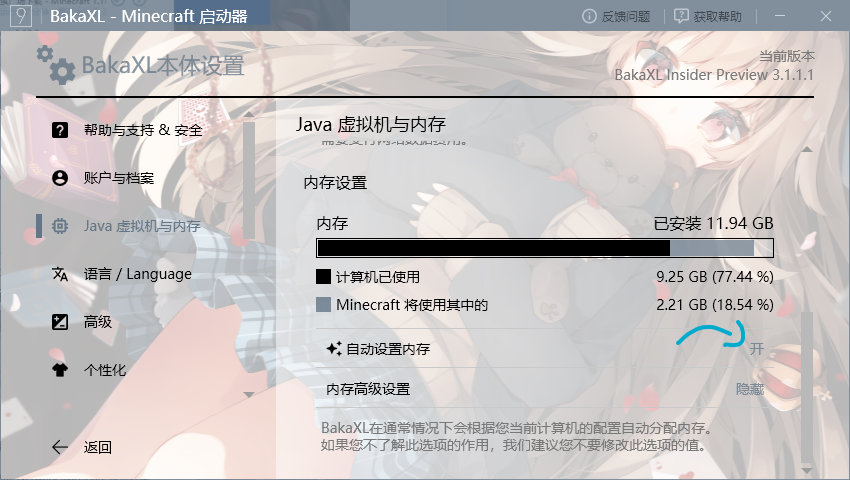
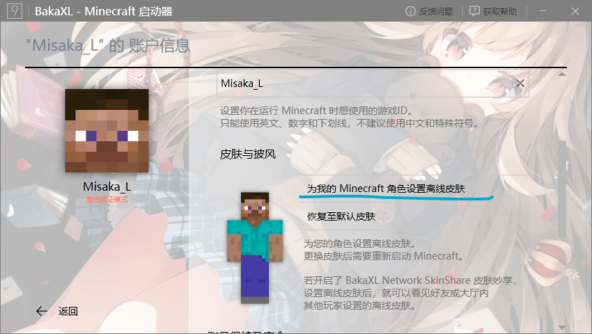
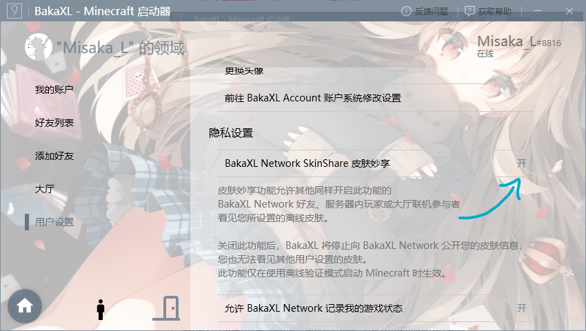
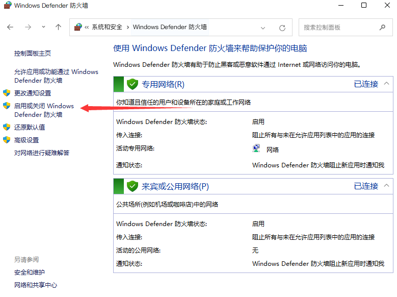
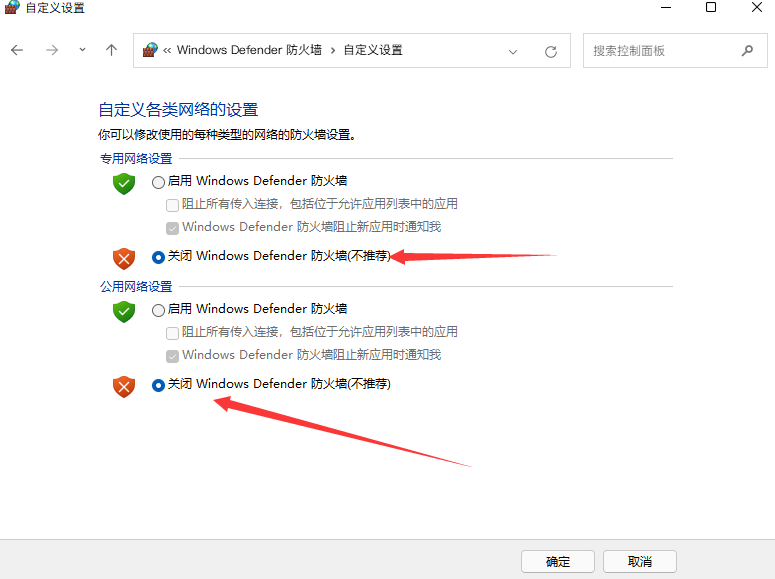
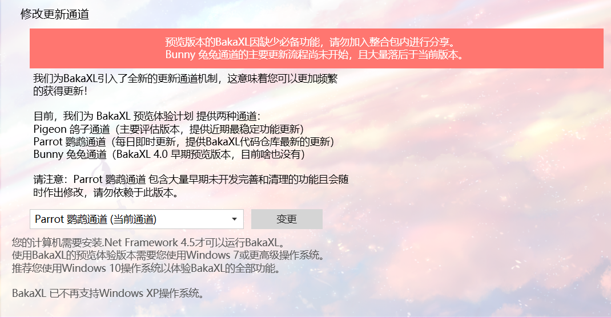

# 新一代脑子有洞的启动器帮助文档

崩坏 · 丧病 · 精神污染

> 使用左侧的侧边栏目录来快速寻找您的问题
> 
> 

### 切换 Minecraft 核心

---

点击`启动游戏`按钮旁边的`切换核心图标`，或向右拖拽「启动游戏」按钮

### 设置游戏核心

### 启动游戏时卡死了

---

前往`本体设置`-`Java 虚拟机与内存`，下翻到`内存设置` ，可以自行设置， 但 BakaXL 推荐您打开`自动设置内存`

### 在 Minecraft 「多人游戏」里无法显示大厅房间

---

> 您可能需要管理员权限，或联系您的系统管理员

> 如果没能解决您的问题，请联系开发者 TT702

1. 删除`C:\Windows\System32\drivers\etc\hosts`

1. 按下`Windows`+`X` ，选择`Windows Powershell (管理员)`或`命令提示符 (管理员)`或`Windows 终端 (管理员)`

1. 在弹出的窗口输入`netsh winsock reset`，并按下`Enter`执行

1. 重新启动您的电脑

### 在 BakaXL 大厅联机中使用离线皮肤

---

1. 前往`本体设置`并选择`账户与档案`
1. 选择您的离线档案，并`点击为我的 Minecaft 角色设置离线皮肤`
1. 
1. 前往`领域 / 联机大厅`并选择`用户设置`
1. 确保`BakaXL Network SkinShare 皮肤妙享`为`开`

### 在 BakaXL 大厅联机中玩家之间无法显示对方的皮肤

---

> 请让大厅内的正版用户操作

1. 前往`本体设置`并选择`账户与档案`

1. 选择您的正版档案。

1. 确保`使用此正版档案时加入皮肤妙享网络`为`开`

> 当  启用`此正版档案时加入皮肤妙享网络` 时，你将无法进入开启了正版验证的服务器。

### Minecraft 游戏崩溃了

---

若您的游戏版本是 Minecraft 1.8 - 1.16.5，请参考此篇文档。

[Minecraft 1.8 - 1.16.5 崩溃如何处理？](http://frp.freefrp.net:15482/#/docs/Minecraft_1.8-1.16.5_CRQA.md)

### 在 BakaXL 大厅联机中显示 “连接超时”

---

> 若还没解决此问题，请在 BakaXL 用户群求助

> 此提示可能是防火墙造成的问题

1. 打开 Windows 系统的开始菜单搜索 `控制面板`
1. 前往`系统和安全`
1. 前往`Windows Defender 防火墙`
1. 在旁边一栏找到`启用或关闭 Windows Defender 防火墙`
1. 
1. 关闭`Windows Defender 防火墙`

1. 点击确定

> **若大厅显示 NAT 严格，请双方都打开中继连接**

### 版本更新通道

`设置` -->`BakaXL 预览体验计划`来更改更新通道。

> 推荐使用`Parrot 鹦鹉通道`

### 微软登录时无法访问微软登录网页

这一般是因为地区问题，微软服务器位于国外，国内访问会缓慢

#### 解决方法

1. 使用加速器，例如[VK 加速器](https://verykuai.com/)，在 VK 加速器中，加速我的世界 Hypixel 就可
2. 更改 DNS 为 4.2.2.1，[更改 DNS 教程（win10）](https://jingyan.baidu.com/article/495ba841ff105d79b20ede24.html) [更改 DNS 教程（win7）](https://jingyan.baidu.com/article/cb5d61053c1fd6415c2fe09e.html)
3. 使用 VPN

**注意：方法 2 并不会百分百解决问题**

### 若此文档未能解决您的问题，请参考这里

---

请寻求 BakaXL 官方群聊中的开发者 / 群员的帮助，或自查。

[如何正确地请求别人的帮助？](docs/询问问题的方法.md)
