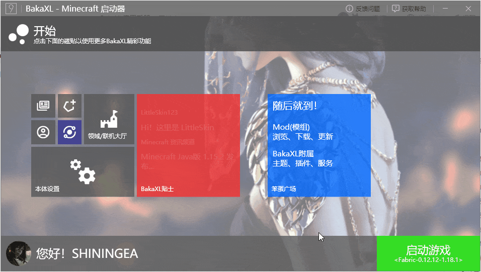

# BakaXL 使用手册

[>>>BakaXL帮助文档](./maindocs.md)

## 开始之前

要运行BakaXL 3.0 及以上版本，您必须使用 Windows 7 及以上操作系统（由于某些功能需要 Windows 10 或以上才能正常运行，我们推荐您升级至Windows 10）并安装 .Net Framework 4.5。

如果您正在使用 Windows XP 或 Windows Vista 以及更低的 Windows 版本，我们推荐您尽快升级至 Windows 10。

[>>下载 Windows 10](https://www.microsoft.com/zh-cn/software-download/windows10)

> 当然，您也可以使用LTS版本（2.2.8.6），使用时出现的问题依旧会上报但由于开发人员缺失原因将不会得到解决。

## 下载

您可以随时在 BakaXL 官网下载最新版本的 BakaXL：

[>>BakaXL官网](https://www.bakaxl.com)

> 『由于服务器需要费用，我们希望您可以对 BakaXL 进行[捐助](https://afdian.net/@TT702)，请在捐助时留下您的 BakaXL Account 邮箱。我们将会给您的账号添加赞助者标识以及 Insider 预览体验计划成员标识，并且您将可以进入 Insiders 局内人内部交流群。』

### 注意

我们**不推荐**在桌面或分区根目录启动 BakaXL。您可以将游戏和启动器保存在其他专用的目录（例如D盘的 Minecraft 文件夹），然后右键 BakaXL，选择「发送到」，然后单击「桌面快捷方式」，即可很方便地从桌面打开BakaXL了！

## 游戏档案

在 BakaXL 中您可以选择离线登录、Mojang 帐号登录、Microsoft 账户登录、第三方登录（Authlib-Injector）四种方法进行登录。

您可以前往:

`本体设置` >`账户与档案` >`新增一个档案` 来创建新的档案。

## 安装后事项

我们推荐您安装 BakaXL 之后调整为「Parrot 鹦鹉通道」更新通道，您可以在此通道内体验最新版本的 BakaXL ，包括很多功能性更新，但可能会有未完成和未清理的功能。

找到`本体设置` > `BakaXL预览计划` >`切换为 Parrot 鹦鹉通道` >`点击变更`

这样您就可以随时更新到 BakaXL 的最新版本啦！

如果因某些原因，BakaXL 无法自动更新或无限更新失败，您也可以随时在 [Jenkins](http://jk-insider.bakaxl.com:8888/job/BakaXL%20Insider%20Parrot/) 下载最后一次构建的结果。

## 更新

当您连接至互联网时，BakaXL 会自动检查可用更新。在有可用更新的情况下，您必须更新才能继续使用 BakaXL。

您仍然可以通过断开您与互联网的连接等方式来绕开更新。（不推荐）

>  BakaXL 若出现无限更新的 Bug 情况您可以前往 [Jenkins ](http://jk-insider.bakaxl.com:8888/job/BakaXL%20Insider%20Parrot/)下载最后一次构建的结果来手动更新 BakaXL。

## Java 环境配置

我们建议您直接打开设置内的「让BakaXL自动选择Java版本」，这样可免去手动设置。以下是手动教程。

### 已安装 Java

如果您之前有安装过 Java，您可以在`本体设置` >`Java虚拟机与内存` `>Java高级设置`中以以下三种方式来指定Java路径：

1. 自动寻找 Java 位置

2. 手动指定 Java 位置

3. 更细致的自动寻找 Java 位置

### 未安装 Java

如果您从未安装过 Java，您可以直接启动游戏，BakaXL 会为您自动下载并安装 Java

如果您需要手动安装特定的 Java8 或 Java16 版本您可以打开`本体设置` >`Java虚拟机与内存` 中找到`获取Java8`与`获取Java17`按钮来获取 Java

### 1.16 及之前的 Minecraft

如果您的游戏版本是 1.16 及以前的版本，那么我们推荐使用 Java 8 来运行游戏。

您可以在 `本体设置` >`Java虚拟机与内存` >`获取Java 8` 来获取 Java 8（通过 MCBBS 提供的链接进行下载，这会打开你的下载工具或浏览器）

### 1.17 及之后的 Minecraft

运行 Minecraft 1.17 或更高版本的 Minecraft 需要使用 Java 17.

您可以在 `本体设置`  >` Java 虚拟机与内存`  >`获取Java 17` 获取。单击该按钮后下载任务会自动开始，BakaXL将会自动下载Java 17至官方启动器目录，但这不需要您安装官方启动器。

### 安装完成之后

一般来说，BakaXL 会自动选择 Minecraft 核心需要的 Java 环境，但在某种情况下这可能不起作用。这时您需要前往 `本体设置` >`Java虚拟机与内存` 来手动选择Java环境。

## 安装新的 Minecraft 核心

您可以从 BakaXL 内轻松地安装 Minecraft 核心。

注意：您可能需要先确保下载源设置最优。前往 `本体设置` >`下载`  >`中国大陆下载源加速` 设置为 `开`，而后镜像服务器选择 `传统`  ，线程数建议设置为 `512 个/不重连`

单击主界面的「C+」 按钮，选择游戏版本，添加 Mod 加载器、OptiFine（可选），开始安装。

## 添加已拥有的 Minecraft 核心 或 整合包

BakaXL支持通过安装 MCBBS(仅限v2版本) 整合包和 CurseForge 整合包来安装 Minecraft 整合包。

您可以向右拖拽  `启动游戏` 滑块 >`添加新的 Minecraft 核心 或 整合包` > `导入整合包` 来添加游戏核心

>**注意**
>
>最新版BakaXL仅支持了最新的MCBBS整合包规范安装（也就是v2.0）。
>
>BakaXL将不再支持2021年8月18日之前通过HMCL等其它启动器导出的旧版MCBBS格式整合包。

## 开始游戏

当您已经安装好了Minecraft核心，您可以在主界面向右拖动 `启动游戏` 按钮来选择游戏核心：

在这之后，点击「启动游戏」按钮，选择一个档案（若您只有一个档案则不用选择），在这之后游戏将会自动启动。

## 使用.BakaSkin文件来个性化您的BakaXL(主题包)

转到`本体设置`  >`个性化`，翻到底部点击 `打开皮肤文件夹`  按钮，将在外部获取到的 .BakaSkin 文件复制进文件夹内，之后再在BakaXL内即可查看皮肤列表。

## BakaXL Network

BakaXL 内置有 BakaXL Network 功能，该功能能够可以实现一些社交操作

### 登录/注册账户

前往`本体设置` >`账户与档案` >`登录至现有的BakaXL账户` 或 `注册一个新的账户`。

### 修改账户头像或资料

前往 `领域` >`用户设置`。

### Bakaverse（领域）

点击 Home 主界面左下角的用户头像即可进入 Bakaverse。

### 添加好友

点击左侧的 `添加好友` 菜单栏，在右侧的输入框中输入好友的 BakaXL Account 账户名称以及数字标签即可发送好友申请。

若您收到了申请，他们也将会显示在输入框的上方。您可以选择同意或拒绝。

在好友申请被通过以后，您将可以在好友列表里找到他们。

### 大厅（联机功能）

选择 `大厅` 菜单栏，您可以 创建/加入一个大厅。

首先确认和您的好友的 Minecraft 都已启动，然后由房主（存档拥有者）进入「单人游戏」，打开一个世界，按下 `Esc` 然后在暂停菜单中选择「对局域网开放」，而后回到 BakaXL 选择`创建一个大厅`，其他玩家使用大厅的8位数字ID加入。

加入方和创建方请务必打开`在无法直接连接时使用中继连接` 选项以确保能够正常联机游玩，关于使用 BakaXL Relay 的隐私协议您可以参考

[>>>BakaXL隐私政策](https://www.bakaxl.com/Privacy/Policy/)

加入大厅之后，前往「多人游戏」，该大厅将会自动显示在列表里。若您无法加入游玩，BakaXL将会在大厅的玩家列表内显示您的状态，而BakaXL本次的运行日志也是未来诊断问题所在的手段。

### 皮肤妙享（离线皮肤共享）

该功能同时在大厅和第三方服务器中生效

这意味着只要多人游戏的玩家使用BakaXL作为启动器并开启本功能时，就可互相看到对方的皮肤而无需其他mod或插件。

只需要在`「本体设置」`- `「账户与档案」` 点击你的离线档案，设置皮肤

之后前往`「领域/联机大厅」`-`「用户设置」`，确保`「BakaXL Network SkinShare 皮肤妙享」`为开启状态 

注：请尽量[在离线登录下使用此功能](./maindocs.html#在-bakaxl-大厅联机中玩家之间无法显示对方的皮肤)

>  如果您阅读了此使用手册和[帮助文档](./maindocs.md)后仍未解决您的问题，可以在BakaXL Outsider QQ群（480455628）来寻求帮助。