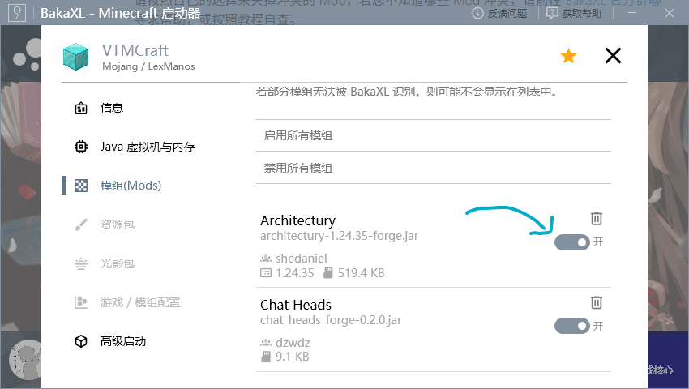
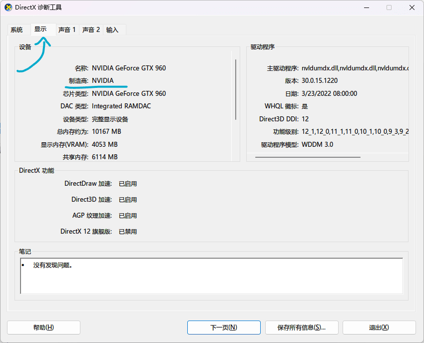
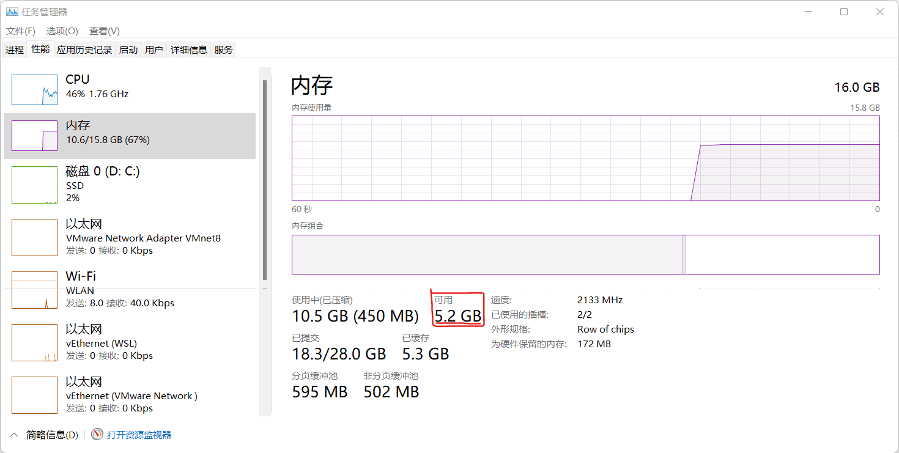

# Minecraft 1.8-1.16.5 版本常见游戏崩溃问题

- 本文适用游戏版本：Minecraft 1.8 - 1.16.5
- 本文适用系统版本：Windows 7 及以上
- 使用计算机阅读效果更佳。

> 使用右侧侧边栏目录快速查找您的问题
>
> 

## Java 配置错误

***

### 使用 Forge 时

由于`Forge`的神奇兼容性，**请使用**`Java 8`**来运行你的 Minecraft**，若仍然崩溃，请勿使用 `Java 8u321` 。（推荐使用：[__Java 8u312__](https://download.bell-sw.com/java/8u312+7/bellsoft-jre8u312+7-windows-amd64-full.msi))

### 原版 & Fabric

虽然 Minecraft 原版 以及 Fabric 支持高版本的 Java，但是我们仍然推荐您使用 Java 8。

> 不要使用 Java 8u321，你可以替换为 Java 8u312 或者最新版本的 Java 8。

## Mod 冲突

***

请按照自己的选择来关掉冲突的 Mod，若您不知道哪些 Mod 冲突，请前往 [__BakaXL 官方群聊__](https://jq.qq.com/?_wv=1027&k=TwvkLgkB)寻求帮助，或按照教程自查。

## 显卡驱动过旧 / 未安装

***

在这之前，您需要了解您电脑所使用显卡的厂商。

> 笔记本用户可以直接跳过此节

1. 按下`Win`+`R`调出`运行`窗口

1. 在运行窗口中输入`dxdiag` ，并点击`确定` 

1. 在弹出的窗口中点击`显示` ，在`制造商`一列将会显示您的显卡制造商

### 笔记本

请前往您的笔记本制造商的官方网获取对应的驱动程序软件。

### Intel 处理器

请下载 [__英特尔™驱动程序和支持助理__](https://dsadata.intel.com/installer) 来更新显卡驱动。

### AMD 显卡 / 处理器

前往 [__AMD 驱动程序与支持__](https://www.amd.com/zh-hans/support) 页面根据您的显卡 / 处理器型号下载最新的驱动程序 。

### NVIDIA 显卡

请前往 [__NVIDIA 驱动程序__](https://www.nvidia.cn/geforce/drivers/) 页面根据显卡型号和需要下载最新的显卡驱动。

## 分配内存过大 (过小)

***

1. 前往`本体设置`并选择`Java 虚拟机与内存`

1. 点击`内存设置`

1. 确保`自动设置内存`为`开`

> 若您会手动分配内存，可以参考：

> 最低内存设置为 1GB 

> Mod 越多（或材质包分辨率更大，能见度更远）时你需要分配更多的内存，但是不要超出你的可用内存。

## 无法解决问题 / 其他

请寻求 BakaXL 官方群聊中的开发者 / 群员的帮助，或自查。

[如何正确地请求别人的帮助？](./How_To_Ask_Question.md)

