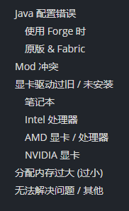
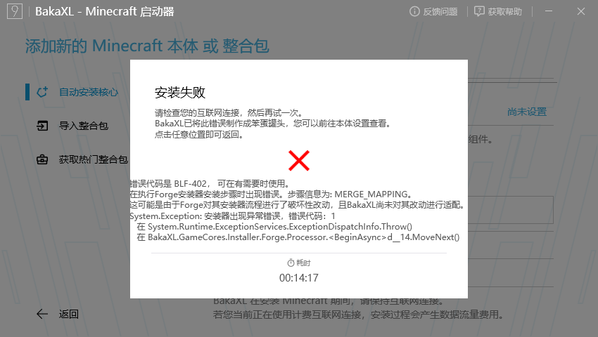
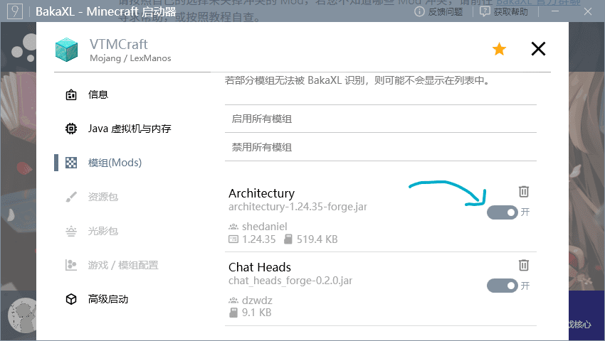
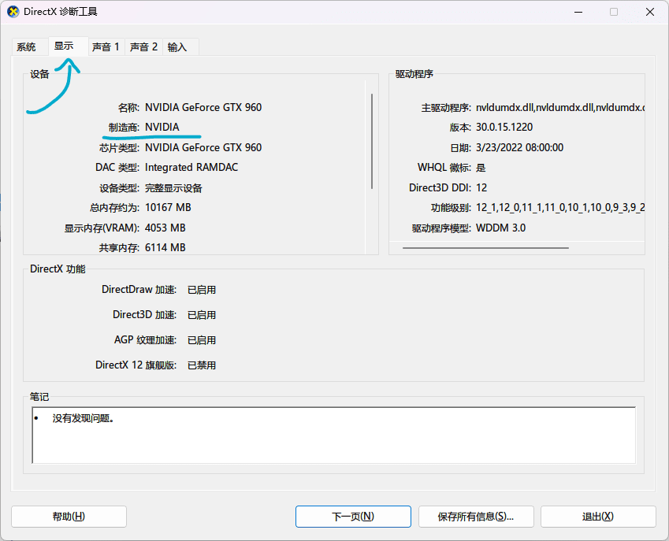
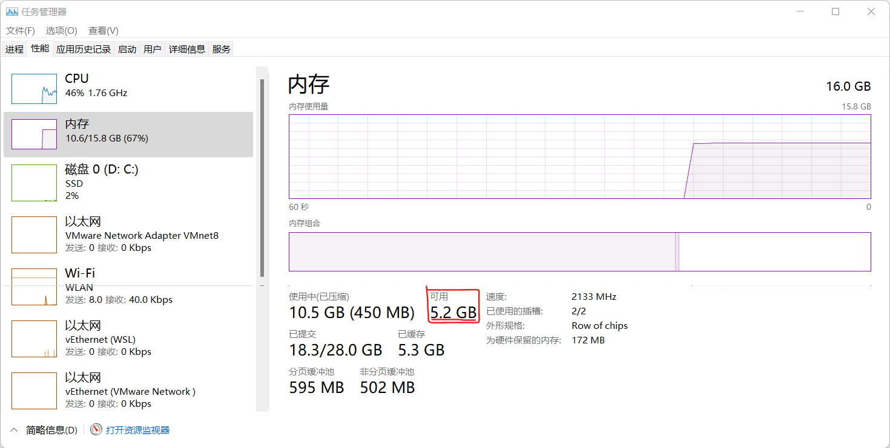

# 常见游戏崩溃问题

- 本文适用的游戏：Minecraft；
- 本文适用系统版本：Windows 7 及以上；
- 使用计算机阅读效果更佳。

:::tip 提示
使用左侧的侧边栏目录来快速寻找您的问题。

:::

## Java 配置错误

::: warning
请在排查问题前，前往 BakaXL 本体设置 - Java 虚拟机与内存 ，打开 `让 BakaXL 自动决定 Java 版本` 选项。

除非您知道您在做什么，否则强烈不建议手动选择 Java 版本。
:::

### 使用 Forge 时

由于 `Forge` 的兼容性问题，**请务必确保打开了自动选择 Java 选项** 。若仍然崩溃，请尝试从 BakaXL 本体设置 获取来自 Mojang 官方的 Java 8。您也可以点击[此链接](https://cdn.azul.com/zulu/bin/zulu8.58.0.13-ca-jre8.0.312-win_x64.msi)下载来自 Azul Zulu 的 Java 8u312 安装包并安装。

## 安装 Forge 错误

当您在安装 `Forge` 时，可能会遇到一个看似无法解决的 `BLF-402` 问题

此问题出现时一般还伴随着核心安装出现问题，安装后的原版核心或导入的整合包**无法在版本列表中找到**

若您的核心 **安装速度飞起** 但是安装后无法在版本列表中找到，请 **一并参照以下方法解决** 

此问题一般是 **网络环境问题或系统原因** 导致，以下给出解决办法

:::tip 解决方法

- 首先更新您的启动器通道至鹦鹉通道
- 其次检查您的系统是否有可用的更新，如果是请安装更新后重试，若没有则直接进行下一条 **（特定情况下可能起关键作用）**
- 关闭或打开 `中国大陆地区使用第三方下载源加速` 后尝试重新安装版本
- 当您发现以上三点均无法解决您的问题时，您将不得不采取最后一种措施: 使用 **科学上网并开启全局代理** 且关闭 `中国大陆地区使用第三方下载源加速`。这是我们目前发现并确认过的对于此错误的最有效的解决方式

**为回应法律法规的要求，我们将不优先推荐使用最后一点方法解决问题，并且我们承诺无任何分发、售卖非法软件的行为**
:::

## Mod 冲突

请按照自己的选择来禁用冲突的 Mod，若您不知道哪些 Mod 冲突，请前往 [__BakaXL 官方群聊__](https://jq.qq.com/?_wv=1027&k=TwvkLgkB)寻求帮助，或按照教程自查。

## 显卡驱动过旧 / 未安装

在这之前，您需要了解您电脑所使用显卡的厂商。

::: tip 提示
笔记本用户通常可以直接跳过此节。
:::

1. 按下 `Win` + `R` 调出 `运行` 窗口；

2. 在运行窗口中输入 `dxdiag` ，并点击 `确定` ；

3. 在弹出的窗口中点击 `显示` ，在 `制造商` 一列将会显示您的显卡制造商。

### 笔记本用户

请前往您的笔记本制造商的官方网站获取对应的驱动程序软件。

### Intel 核芯显卡

请下载 [__英特尔™驱动程序和支持助理__](https://dsadata.intel.com/installer) 来更新显卡驱动。

### AMD 显卡 / 处理器

前往 [__AMD 驱动程序与支持__](https://www.amd.com/zh-hans/support) 页面根据您的显卡 / 处理器型号下载最新的驱动程序 。

### NVIDIA 显卡

请前往 [__NVIDIA 驱动程序__](https://www.nvidia.cn/geforce/drivers/) 页面根据显卡型号和需要下载最新的显卡驱动。

## 分配内存过大 (过小)

1. 前往 `本体设置` 并选择 `Java 虚拟机与内存`；
2. 点击 `内存设置`；
3. 确保 `自动设置内存` 为 `开`。

::: warning 警告
当您选择手动分配内存时，请确保分配的内存没有超过您目前可用的最大内存。
:::

::: tip 提示
Mod 越多（或材质包分辨率更大，能见度更远）时你需要分配更多的内存，但是不要超出你的可用内存。
:::

## 无法解决问题 / 其他

请寻求 BakaXL 官方群聊中的开发者 / 群员的帮助，或在其它例如 MCBBS 等交流论坛询问以及利用搜索引擎查询解决方案。

[如何正确地请求别人的帮助？](./How_To_Asking_Question.md)

