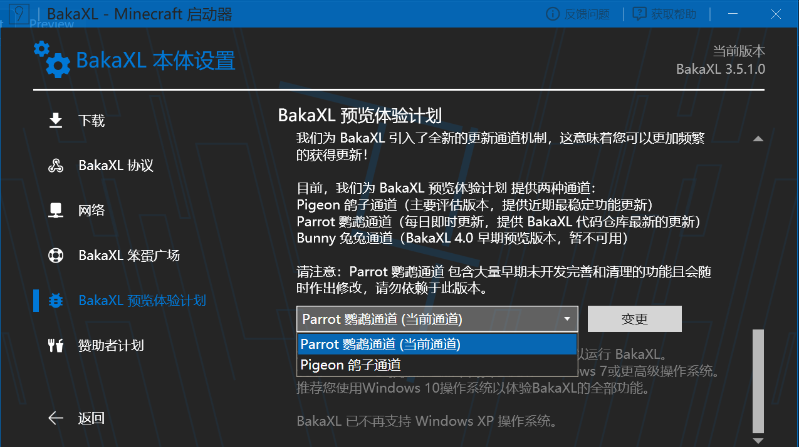

# BakaXL 启动器常见问题解决方案文档

:::tip 提示
使用左侧的侧边栏目录来快速寻找您的问题。

:::

## 常见 BakaXL 问题一览

### 如何切换启动器更新通道

在您发现您的启动器出现了各种各样的奇怪的报错与错误时，将启动器 **切换至非树獭 (Sloth) 通道** 是非常重要的一点，也是解决问题的前提

切换启动器更新通道的方法如下

:::tip
- 进入本体设置
- 下滑找到 `预览体验计划`
- 点击 `变更` 左边的小三角选择 **鹦鹉通道或鸽子通道**
- 最后点击变更并接受更新即可

:::

参加预览体验计划虽然可以更快的获取更新，能够避免更多的 Bug 出现，但相应的也 **可能会发生一些不可预知的错误**

若发现错误请 **尽快上报 BakaXL 开发团队** 以解决您的问题

### 如何切换 Minecraft 核心

点击 `启动游戏`按钮旁边的 `切换核心图标`，或向右拖拽「启动游戏」按钮。

### 在导入整合包时提示非标准整合包格式

> BakaXL 目前支持 CurseForge / Modrinth / MCBBS v2 版本的整合包以及部分带有启动器的 Minecraft 游戏压缩包。

前往 `本体设置` > `BakaXL 预览体验计划`，选择 `鹦鹉通道`，点击 `变更`，等待更新完成后再次尝试安装。

若依旧安装失败您可以前往用户交流群反馈这一情况，当然也欢迎在我们的 Issues 反馈。

## 游戏问题一览

### 我使用 BakaXL 启动其他启动器所安装的游戏版本，但 Mod 、资源包、光影未加载 / 存档消失了

这通常是因为您先前所使用的启动器**未打开**[**版本隔离**](./about_version_seperation.md "关于版本隔离")导致的。

为避免新手存在**无法同时安装多个含加载器的版本**的问题，BakaXL 默认且**锁定**为开启版本隔离。

若存在 Mod / 资源包 / 光影 / 存档 / 数据包 等不加载的情况：

1. 请使用 BakaXL [安装含对应 Mod 加载器的版本](./BakaXL_Use_Docs.md#添加已拥有的-minecraft-核心-或-整合包)（精确到加载器版本号）；
2. 将 *`.minecraft`* 目录下 *`saves`*（游戏存档），*`mods`*（模组），*`resourcepacks`*（资源包），*`shaderpacks`*（光影包）文件夹移动至 *`.minecraft/versions/(对应版本的文件夹名称)`* 文件夹中；
3. 重新启动该版本。

若希望同步版本之间的 Mod，资源包，光影，存档等，请参考此篇文档：[关于版本隔离](./About_Version_Seperation.md "关于版本隔离")

> 若您使用 `Fabric` 作为模组加载器，请安装 `Mod Menu` 模组，否则将不会在游戏内显示 `Mod` 按钮。

### 我使用 BakaXL 打开其他启动器所使用的 .minecraft 文件夹，却显示没有可用核心

解决方法同上问。

### 启动游戏时卡死了

前往 `本体设置` - `Java 虚拟机与内存`，下翻到 `内存设置`，可以自行设置， 但 BakaXL 推荐您打开 `自动设置内存`。

### Minecraft 游戏崩溃了

#### 若您的版本是 Minecraft 1.17 及以上

请确保使用了 [Java17](https://download.bell-sw.com/java/17.0.3+7/bellsoft-jre17.0.3+7-windows-amd64-full.msi) 及以上（推荐使用[Java17](https://download.bell-sw.com/java/17.0.3+7/bellsoft-jre17.0.3+7-windows-amd64-full.msi)）。

#### 若您的游戏版本是 Minecraft 1.8 - 1.16.5

请参考此篇文档：[Minecraft 1.8 - 1.16.5 崩溃如何处理？](./Minecraft_1.8-1.16.5_CRQA.md)

#### 若您的版本是 Minecraft 1.7.10

在此版本使用正版账户登录也许会出现一些意想不到的问题，若您没有特殊需求建议选择离线账户登录。

#### 全版本游戏通用的崩溃问题

::: warning 警告
在系统使用 Unicode UTF-8 的情况下使用中文目录存储 / 启动游戏必定会导致游戏崩溃。

关于如何找到 Unicode 选项请参照: [将 Windows10 设置为 UTF8 编码格式 - CSDN](https://blog.csdn.net/xt_v2012/article/details/93784751)
将选项 `Beta 版: 使用 Unicode UTF-8 提供全球语言支持 (U)` 旁的复选框取消勾选后重新启动即可关闭 Unicode UTF-8 

若出现重启后检查依旧仍在使用 Unicode UTF-8 模式请参考: 
[地區設定 勾選 “Beta 版：使用 Unicode UTF-8 提供全球語言支援” 後重開機依舊無法更改回來 - Microsoft Q&A](https://answers.microsoft.com/zh-hant/windows/forum/all/%E5%9C%B0%E5%8D%80%E8%A8%AD%E5%AE%9A/e596c312-1eda-41c2-a85e-f41a1f5ced9e) 一文中独立顾问 “A Big 蓝鲸” 提供的方法。
:::

1. .minecraft 目录中存在中文字符有可能导致游戏崩溃，如果发生了崩溃情况请尝试移出中文路径；

>为了解决问题同时不影响该目录下其他应用程序的日常使用
>
>请将 <kbd><em>BakaXL.exe</em></kbd>，<kbd><em>BakaXL</em> 文件夹</kbd>，<kbd><em>.minecraft</em> 文件夹</kbd>
>
>移动至不含有中文字符的同一目录下

2. Mod 冲突 / 存在不适配的 Mod / 缺少前置 Mod：

请参考此篇文档：[>>> Mod 冲突](./Minecraft_1.8-1.16.5_CRQA.md/#mod-冲突)

## 联机攻略

### 1.开启 IPv6
IPv6 是新一代互联网协议，它解决了 IPv4 地址枯竭的问题。我国目前正在大力发展 IPv6，所有宽带和手机运营商均需要提供 IPv6 地址，部分高校网络也提供了 IPv6 地址。

通过 IPv6 协议，每个设备都能够拥有属于自己的独立 IP 地址，也就是说，可以在不经过中继的情况下就实现设备之间的直接互联！

如果您是家庭宽带，请先尝试开启您的路由器中的 IPv6 设置。如果启动器大厅内本地网络环境显示 **优先建立 IPv6 连接**，就说明您可以正常使用 IPv6 网络了！

注意，通过 IPv6 联机需要大家**都拥有 IPv6 地址**才可使用。如果您们当中有人无法开启 IPv6，请使用下一种方法。

### 2.使用网游加速器

使用 [迅游加速器](https://www.xunyou.com/)，即可享受更加高速稳定的联机体验。配合迅游高速组网，让全球玩家都能共同游戏。同时迅游还支持 Hypixel 加速，畅玩海外知名小游戏服。

使用兑换码：“**BakaXL**”，即可免费领取 3 天体验资格，并享受 85 折优惠续费。

### 3.使用BakaXL中继服务
如果暂时不考虑使用加速器，可以考虑使用BakaXL的中继服务。

在大厅中开启 “**在无法建立直接连接时使用中继连接**” 选项，即可使用由赞助商“蓝科数据”提供的可信的免费中继服务。

## 联机问题一览

::: tip 提示
目前 BakaXL 大厅正在公开测试，详情请查阅 [BakaXL / PCL2 / HMCL 对联机功能下一步发展的联合公告](https://www.bilibili.com/read/cv19553724) 。
Octo 章鱼网络 正处于测试阶段，届时将支持 HMCL、PCL 与 BakaXL 三启动器互联。
:::

### 在 BakaXL 大厅里面无法创建大厅

> 在创建大厅前，请检查您的 Minecraft 是否打开了局域网联机。

首先，请检查您正在使用的的 Java 路径是否存在 `Javapath` 字样。若有，请更换其他 Java。

同时请确保您的 BakaXL 为最新鹦鹉通道预览版。

[&gt;&gt;如何更新到最新预览版 BakaXL](#如何更新到最新预览版BakaXL)

### 在 BakaXL 大厅联机中使用离线皮肤

1. 前往 `本体设置`并选择 `账户与档案`
2. 选择您的离线档案，并点击 `为我的 Minecaft 角色设置离线皮肤`

3. 前往 `领域 / 联机大厅` 并选择 `用户设置`
4. 确保 `BakaXL Network SkinShare 皮肤妙享` 设置为 `开`

### 在 BakaXL 大厅联机中玩家之间无法显示对方的皮肤

> 请让大厅内的正版用户操作

1. 前往 `本体设置` 并选择 `账户与档案`
2. 选择您的正版档案。
3. 确保 `使用此正版档案时加入皮肤妙享网络` 设置为 `开`

### 在 Minecraft 「多人游戏」里无法显示大厅房间

> 您可能需要以管理员身份运行 BakaXL
> 在此之前请先[关闭防火墙](####检查防火墙)

请先检查您的 BakaXL 是否**关闭**了 IPv6 协议栈:

1. 打开 `本体设置` 选择 `高级`
2. 关闭 `高级启动` 的 `启用 IPv6 协议栈`
3. 重启 Minecraft 与 BakaXL

如果您的游戏使用其他启动器启动，请确保**您和加入者**的高级启动参数中的 **JVM 参数头**包含了 `-Djava.net.preferIPv4Stack=true` 这一参数

在 PCL2 中添加 JVM 参数:

1. 打开 `版本设置`
2. 点选 `设置` 选项卡
3. 在 `高级启动选项` 中的 `JVM参数头` 中加入 `-Djava.net.preferIPv4Stack=true` 后返回

在 HMCL 中加入 JVM 参数:

1. 点击你的游戏版本
2. 勾选 `启动游戏特定设置` 或 `编辑全局版本设置`
3. 找到 `高级选项` 点击 `修改高级选项`
4. 向下滚动找到 `Java 虚拟机参数` 一栏，填入 `-Djava.net.preferIPv4Stack=true` 后返回

::: tips 提示
以上方法应该能够修复您无法找到多人大厅的情况，同时请务必[配置 BakaXL 通过 Windows 防火墙](####检查防火墙)
若配置防火墙后执行以上方法仍无法使用可以尝试以下方法
:::

1. 用记事本打开 `C:\Windows\System32\drivers\etc\hosts` ，删除其中的所有内容并保存；
2. 按下 `Windows` + `X` ，选择 `Windows Powershell (管理员)` 或 `命令提示符 (管理员)` 或 `Windows 终端 (管理员)`；
3. 在弹出的窗口输入 `netsh winsock reset`，并按下 `Enter` 执行；
4. 重新启动您的电脑。

除此之外，您还需要确定您没有启动未联网的网卡，未启动游戏加速器加速其它游戏，未使用透明代理或旁路由等特殊情况

**关闭多余的网卡参照以下步骤:**
1. 按下 `Windows` + `R`，输入 `ncpa.cpl` 并回车
2. 关闭所有不需要使用网络适配器（图标旁带红叉的均无法连接到互联网，可以放心关闭）
3. 重新启动 BakaXL 与 Minecraft

> 如果以上方法未能解决您的问题，请联系开发者 TT702，他目前正在积极收集发生这些情况的人员以解析是什么问题。

### 在联机时连接至大厅创建者时出现 `no further information` 错误

- 通常出现这种情况是因为房主退出了游戏或者大厅炸了。

> 如果没有出现上述情况请尝试更新您的 BakaXL 至最新测试版，并确保联机双方已打开中继开关。在此之后，尝试使用连接助理。若不能解决问题，请前往 BakaXL 用户群寻求帮助。

[&gt;&gt;如何更新到最新预览版 BakaXL ](#如何更新到最新预览版BakaXL)

### 在 BakaXL 大厅联机中显示 “连接超时”

> 若未能解决此问题，请在 BakaXL 用户群中求助。

- 请检查您在 BakaXL 大厅中的状态，如果显示为 `大厅中 / 连接已建立`或 `大厅中 / 已通过中继建立连接` ，请使用 `连接助理`。

- 若您创建大厅时选择了使用服务端实例来进行联机那么请注意您是否开启了验证，如第三方验证、正版验证会导致没有相应验证资质的玩家无法加入游戏。

#### 检查防火墙

1. 打开开始菜单，直接打字即可调出搜索功能，在搜索框内输入 `控制面板`；
2. 找到 `系统和安全`类别；
3. 进入 `Windows Defender 防火墙`；
4. 在侧边栏栏找到 `允许应用或功能通过 Windows Defender 防火墙`；
5. 点击 `更改设置` ，之后，点击 `允许其他应用`；
6. 点击 `浏览` ，之后选择您的 BakaXL 本体并点击 `添加`；
7. 点击确定。

> **若大厅显示 `连接失败 / NAT 严格` ，请启用 BakaXL Network Relay 中继连接功能 (大厅创建者和加入者都需要启用以生效)**。

### 出现 `io.netty buffer` 联机失败

::: tip 提示
io.netty 错误有很多，但是以 buffer 导致的连接失败只有一个，因此您只需要捕捉关键字 `io.netty` 和 `buffer`；

在出现这类错误时请您提交一份 Mod 包给 BakaXL 开发团队以便找到不支持的 Mod。
:::

这类问题的出现并非由于 BakaXL 导致的，而是由于 Mod 本身不支持 SSP LAN (即局域网广播)，来自 Mod 的缺陷只能依靠 Mod 开发者解决或使用其它方法联机
如果 Mod 不支持 SSP LAN ，那么无论使用什么启动器只要使用的是 SSP LAN 方案便无法进行联机，如果一定要使用这些 Mod 建议使用其它多人联机方案进行联机
目前已测试以下 Mod 的部分版本不支持 SSP LAN：
- 暮色森林（1.18）；
- 豆腐工艺；
- FTB 基础库；

> 虽然以上 Mod 已被归入无法联机的列表，但是您依旧可以尝试进行联机。若出现符合条件的错误，可以方便您快速排除错误原因。

### 在使用连接助理时出现了问题

::: tip 提示
关于连接助理的绝大多数问题可以通过重新加入大厅或重启 BakaXL 解决。
:::

#### 在使用连接助理时取消登录后无法再次重新建立连接

重启 BakaXL 即可解决此问题。

#### 在连接助理通知完成后点击 "好" 后连接被中断并且无法重新建立连接

重启 BakaXL 即可解决此问题。

#### 多人游戏中不存在来自连接助理的连接

如果你仍能够看见普通的大厅，请优先尝试通过普通大厅来加入游戏，若出现连接超时问题再使用连接助理。

确保你主动点击了连接助理按钮，且 BakaXL 已经弹窗提示你加入，再去多人游戏刷新列表查找大厅。

如果你无法看见任何局域网广播请尝试重新进入大厅再次尝试加入，或重新启动 BakaXL 也可以解决该问题

### 8 人以上 (包括创建者) 联机

#### 方法一

::: tip 提示
该方案只适用于 1.15.2 及以上版本
:::

BakaXL 大厅本身并不限制游戏人数，该限制来自 Minecraft 本身。

请添加名为 `LAN World Plug-n-Play (mcWiFiPnP)` 的 Mod 到您的核心（确保安装了对应的 Mod 加载器），然后在局域网开放界面设置游戏人数。

您可以右键复制 [此链接](https://modrinth.com/mod/mcwifipnp) 并在 BakaXL 主界面按下 Ctrl + V (或 Win + V)，跳转到笨蛋广场来安装该 Mod 以更改最大人数。

#### 方法二

您可以在本地开启服务端并在 `server.properties` 文件中更改最大人数，并通过 BakaXL 大厅进行联机。

## 其它问题

### 微软登录时无法访问微软登录网页

这一般是因为地区问题，微软服务器位于国外，国内访问会缓慢。

**解决方法:**

1. 使用网游加速器，如 [迅游加速器](https://www.xunyou.com/)，加速国际版 Minecraft 相关。使用兑换码：“**BakaXL**”，即可免费领取 3 天体验资格，并享受 85 折优惠续费。
2. 更改 DNS 为 `223.5.5.5` 和 `4.2.2.1`       [更改 DNS 教程 (Win10)](https://jingyan.baidu.com/article/495ba841ff105d79b20ede24.html)  [更改 DNS 教程 (Win7)](https://jingyan.baidu.com/article/cb5d61053c1fd6415c2fe09e.html)；
3. 使用科学上网方法，启动全局代理模式。

> 由于微软一贯网络尿性，国外用户甚至也时常抱怨微软网络问题，因此不保证此方法能够让您成功登录您的正版账户。

### 在联机时 BakaXL 显示仅使用 IPv4

请致电互联网服务提供商（电信 10000 / 联通 10010 / 移动 10086 ）要求上门调试 IPv6。~~若出现拒不调试的情况可以拨打工信部电话 12300 投诉，或在运营商内上报该情况 ~~

## 若此文档未能解决您的问题

- 在 BakaXL 用户群求助，QQ群: [480455628](https://jq.qq.com/?_wv=1027&k=3WQFYmP1)；
- 在 BakaXL 帮助文档中心求助: [以提议的方式求助](https://github.com/BakaXL-Support/BakaXL-QA-docs/issues/new/choose) [以讨论的方式求助](https://github.com/BakaXL-Support/BakaXL-QA-docs/discussions)。

> 通常来说在帮助文档中心求助我们更建议以 *提议的方式* 发送您的问题，但是有些麻烦，因为需要您提供足够的信息来分析原因。
>
> 您通常提前得知道如何正确将信息给予我们。

[《如何正确地请求别人的帮助？》](./How_To_Asking_Question.md)

