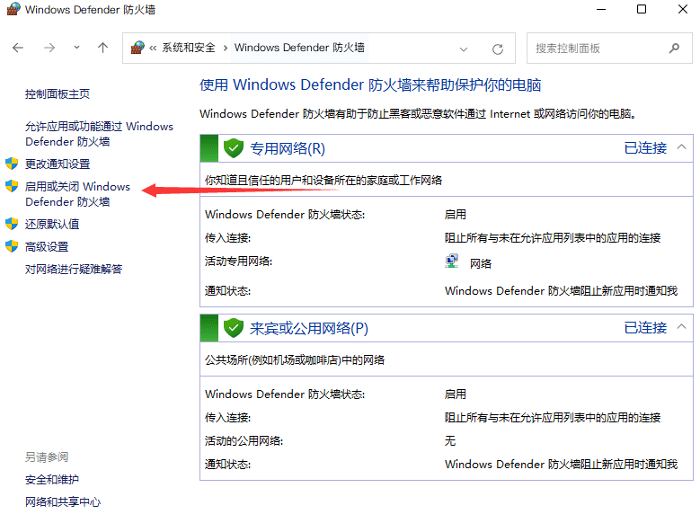

# BakaXL 启动器常见问题解决方案文档

> tips:使用左侧的侧边栏目录来快速寻找您的问题
>
> 

## 常见 BakaXL 问题一览

### BakaXL常见错误代码

见 [BakaXL常见错误代码](.\error_code.md) 一文

### 如何切换 Minecraft 核心

点击 `启动游戏`按钮旁边的 `切换核心图标`，或向右拖拽「启动游戏」按钮

### 在导入整合包时提示非标准整合包格式

> 在您导入前请确保您的整合包格式为 CurseForge 或 MCBBSv2 版本的整合包，而不是整合包中带一个启动器的发布包

前往 `本体设置` >`BakaXL 预览体验计划`，选择 `鹦鹉通道`，点击 `变更`，等待更新完成后再次尝试安装

若依旧安装失败您可以前往用户交流群反馈这一情况，当然在我们的 issues 反馈也欢迎

> 若出现安装无 Mod 的情况请先使用 HMCL 导出再安装：确保使用最新版（3.5.3 / 3.5.2.218）HMCL。点击 `版本列表` >`右键要导出的整合包` >`导出整合包` >`我的世界中文论坛标准整合包` 改个名字-一路下一步至导出完成后再将导出的包导入到 BakaXL 即可

### 在 BakaXL 大厅里面无法创建大厅

> 在创建大厅前，请检查您的 Minecraft 是否打开了局域网联机。

> 如果无法创建大厅，请检查您正在使用的的 Java 路径是否存在 `Javapath` 字样。若有，请卸载更换其他 Java/JDK

请确保您的 BakaXL 为最新鹦鹉通道预览版

[&gt;&gt;如何更新到最新预览版 BakaXL](#如何更新到最新预览版BakaXL)

### 在 BakaXL 大厅联机中使用离线皮肤

1. 前往 `本体设置`并选择 `账户与档案`
2. 选择您的离线档案，并 `点击为我的 Minecaft 角色设置离线皮肤`

3. 前往 `领域 / 联机大厅`并选择 `用户设置`
4. 确保 `BakaXL Network SkinShare 皮肤妙享`为 `开`

### 在 BakaXL 大厅联机中玩家之间无法显示对方的皮肤

> 请让大厅内的正版用户操作

1. 前往 `本体设置`并选择 `账户与档案`
2. 选择您的正版档案。
3. 确保 `使用此正版档案时加入皮肤妙享网络`为 `开`

### 如何更新到最新预览版 BakaXL

> 由于 BakaXL 更新周期机制，正式版的 Bug 很有可能比预览版的 Bug 还多(特性)

打开 `本体设置` 选择 `BakaXL 预览体验计划`来更改更新通道，我们通常推荐使用鹦鹉通道，因为大部分Bug会被及时修复

### 进入笨蛋广场提示“BakaXL笨蛋广场目前仍在施工，当前尚未支持资源下载”

请更新至最新预览版BakaXL，详细操作[在这里](#如何更新到最新预览版BakaX)

## 游戏问题一览

### 我使用BakaXL启动其他启动器所安装的游戏版本，但mod、资源包、光影未加载/存档消失了

这通常是因为您先前所使用的启动器**未打开**[**版本隔离**](./about_version_seperation.md "关于版本隔离")导致的

为避免新手存在**无法同时安装多个含加载器的版本**的问题，BakaXL默认且**锁定**为开启版本隔离

若存在 mod/资源包/光影/存档/数据包 等不加载的情况

1. 请使用 BakaX L[安装含对应mod加载器的版本](./BakaXL_Use_Docs.md#添加已拥有的-minecraft-核心-或-整合包)（精确到加载器版本号）
2. 将 *`.minecraft`* 目录下 *`saves`*（游戏存档），*`mods`*（模组），*`resources`*（资源包），*`shaderpacks`*（光影包）文件夹移动至 *`.minecraft/versions/(对应版本的文件夹名称)`* 文件夹中
3. 重新启动该版本

若希望同步版本之间的mod，资源包，光影，存档等，请参考此篇文档。

[关于版本隔离](./About_Version_Seperation.md "关于版本隔离")

>若您使用`Fabric`作为模组加载器，请安装`Mod Menu`模组，否则将不会在游戏内显示`Mod`按钮

### 我使用BakaXL打开其他启动器所使用的.minecraft文件夹，却显示没有可用核心

解决方法同上问

### 启动游戏时卡死了

前往 `本体设置`-`Java 虚拟机与内存`，下翻到 `内存设置`，可以自行设置， 但 BakaXL 推荐您打开 `自动设置内存`

### Minecraft 游戏崩溃了

#### 若您的版本是 Minecraft 1.17 及以上

请确保使用了[Java17](https://download.bell-sw.com/java/17.0.3+7/bellsoft-jre17.0.3+7-windows-amd64-full.msi)及以上（推荐使用[Java17](https://download.bell-sw.com/java/17.0.3+7/bellsoft-jre17.0.3+7-windows-amd64-full.msi)）

#### 若您的游戏版本是 Minecraft 1.8 - 1.16.5

请参考此篇文档

[Minecraft 1.8 - 1.16.5 崩溃如何处理？](./Minecraft_1.8-1.16.5_CRQA.md)

#### 若您的版本是 Minecraft 1.7.10

在此版本使用正版账户登录也许会出现一些意想不到的问题，若您没有特殊需求建议选择离线账户登录

#### 全版本通性

1. .minecraft目录中存在中文字符

>为了解决问题同时不影响该目录下其他应用程序的日常使用
>
>请将 <kbd><em>BakaXL.exe</em></kbd>，<kbd><em>BakaXL</em> 文件夹</kbd>，<kbd><em>.minecraft</em> 文件夹</kbd>
>
>移动至不含有中文字符的同一目录下

1. mod 冲突/存在不适配的mod/缺少前置mod

>请参考此篇文档
>
>[Mod 冲突](./Minecraft_1.8-1.16.5_CRQA.md/#mod-冲突)

### 在 Minecraft 「多人游戏」里无法显示大厅房间

> 您可能需要以管理员身份运行 BakaXL
> 如果没能解决您的问题，请联系开发者 TT702，他目前正在积极收集发生这些情况的人员以解析是什么问题

1. 删除 `C:\Windows\System32\drivers\etc\hosts`
2. 按下 `Windows`+`X` ，选择 `Windows Powershell (管理员)`或 `命令提示符 (管理员)`或 `Windows 终端 (管理员)`
3. 在弹出的窗口输入 `netsh winsock reset`，并按下 `Enter`执行
4. 重新启动您的电脑

### 在联机时连接至大厅创建者时出现 `no further information`错误

> 通常出现这种情况是因为房主退出了游戏或者大厅炸了

如果没有出现上述情况请更改您的 BakaXL 至最新预览版

[&gt;&gt;如何更新到最新预览版 BakaXL](#如何更新到最新预览版BakaXL)

### 在 BakaXL 大厅联机中显示 “连接超时”

> 若未能解决此问题，请在 BakaXL 用户群中求助

> 请检查您在 BakaXL 大厅中的状态，如果显示为 `大厅中/已连接`或 `大厅中/已通过中继连接`请再尝试一次能否加入游戏

#### 检查防火墙

1. 打开开始菜单，直接打字即可调出搜索功能，在搜索框内输入 `控制面板`
2. 找到 `系统和安全`类别
3. 进入 `Windows Defender 防火墙`
4. 在侧边栏栏找到 `启用或关闭 Windows Defender 防火墙`

5. 关闭 `Windows Defender 防火墙`

6. 点击确定

> **若大厅显示 NAT 严格，请启动 BakaXL Relay 中继连接功能(大厅创建者和您都需要启动该功能)**

## 其它问题

### 微软登录时无法访问微软登录网页

这一般是因为地区问题，微软服务器位于国外，国内访问会缓慢

#### 解决方法

1. 使用加速器，例如[VK 加速器](https://verykuai.com/)，在 VK 加速器中，加速我的世界 Hypixel 就可 [→加速教程←](https://kingosuper.zyglq.cn/2022/04/25/%e5%a6%82%e4%bd%95%e4%bd%bf%e7%94%a8vk%e5%8a%a0%e9%80%9f%e5%99%a8%e5%8a%a0%e9%80%9f%e5%be%ae%e8%bd%af%e7%bd%91%e7%ab%99/)
2. 更改 DNS 为 `223.5.5.5` 和 `4.2.2.1`       [更改 DNS 教程(Win10)](https://jingyan.baidu.com/article/495ba841ff105d79b20ede24.html)  [更改 DNS 教程(Win7)](https://jingyan.baidu.com/article/cb5d61053c1fd6415c2fe09e.html)
3. 使用科学上网方法，启动全局代理模式

> 由于微软一贯网络尿性，国外用户甚至也时常抱怨微软网络问题，因此不保证此方法能够让您成功登录您的正版账户

### 在联机时BakaXL显示仅使用IPv4

请致电互联网服务提供商（电信 10000 / 联通 10010 / 移动 10086 ）要求上门调试 IPv6 ~~，若出现拒不调试的情况可以拨打工信部电话 12300 投诉 ~~

## 若此文档未能解决您的问题

- 在BakaXL用户群求助，QQ群: [480455628](https://jq.qq.com/?_wv=1027&k=3WQFYmP1)
- 在BakaXL帮助文档中心求助: [以提议的方式求助](https://github.com/BakaXL-Support/BakaXL-QA-docs/issues/new/choose) [以讨论的方式求助](https://github.com/BakaXL-Support/BakaXL-QA-docs/discussions)

> 通常来说在帮助文档中心求助我们更建议以 *提议的方式* 发送您的问题，但是有些麻烦，因为需要您提供足够的信息来分析原因
>
> 您通常提前得知道如何正确将信息给予我们

[《如何正确地请求别人的帮助？》](./subdocs/How_To_Asking_Question.md)

