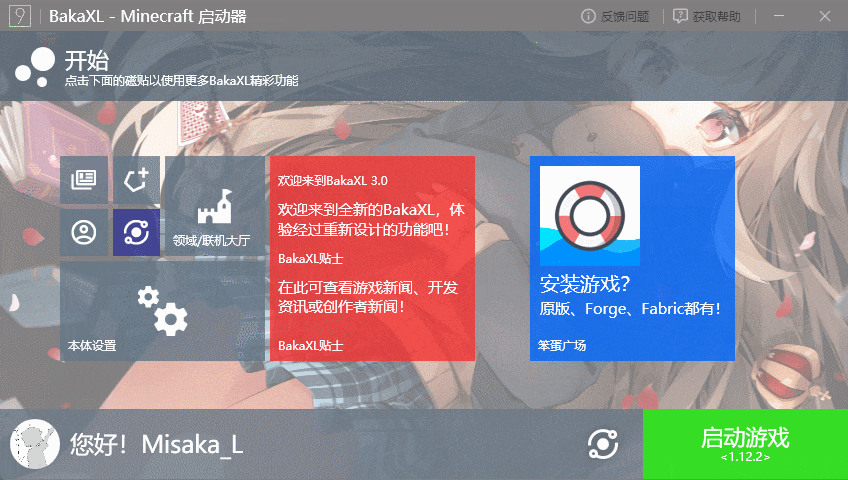

# BakaXL启动器常见问题解决方案文档

> tips:使用左侧的侧边栏目录来快速寻找您的问题
>
> 

## 常见BakaXL问题一览

### 如何切换 Minecraft 核心

点击`启动游戏`按钮旁边的`切换核心图标`，或向右拖拽「启动游戏」按钮

### 在 BakaXL 大厅里面无法创建大厅

> 在创建大厅前，请检查您的 Minecraft 是否打开了局域网联机。

.png)

.png)

> 如果无法创建大厅，请检查您正在使用的的 Java 路径是否存在 `Javapath` 字样。若有，请卸载更换其他 Java/JDK

### 在 BakaXL 大厅联机中使用离线皮肤

1. 前往`本体设置`并选择`账户与档案`
1. 选择您的离线档案，并`点击为我的 Minecaft 角色设置离线皮肤`
1. 
1. 前往`领域 / 联机大厅`并选择`用户设置`
1. 确保`BakaXL Network SkinShare 皮肤妙享`为`开`

### 在 BakaXL 大厅联机中玩家之间无法显示对方的皮肤

> 请让大厅内的正版用户操作

1. 前往`本体设置`并选择`账户与档案`

1. 选择您的正版档案。

1. 确保`使用此正版档案时加入皮肤妙享网络`为`开`

> 当启用 `此正版档案时加入皮肤妙享网络` 时，你将无法进入开启了正版验证的服务器。

### 如何更新到最新预览版BakaXL

> 由于BakaXL 更新周期机制，正式版的Bug很有可能比预览版的Bug还多(特性)

打开`本体设置` 选择`BakaXL 预览体验计划`来更改更新通道，我们通常推荐使用鹦鹉通道，因为大部分Bug会被及时修复

## 游戏问题一览

### 启动游戏时卡死了

前往`本体设置`-`Java 虚拟机与内存`，下翻到`内存设置`，可以自行设置， 但 BakaXL 推荐您打开`自动设置内存`

### 在 Minecraft 「多人游戏」里无法显示大厅房间

> 您可能需要以管理员身份运行BakaXL
> 如果没能解决您的问题，请联系开发者 TT702，他目前正在积极收集发生这些情况的人员以解析是什么问题

1. 删除`C:\Windows\System32\drivers\etc\hosts`

1. 按下`Windows`+`X` ，选择`Windows Powershell (管理员)`或`命令提示符 (管理员)`或`Windows 终端 (管理员)`

1. 在弹出的窗口输入`netsh winsock reset`，并按下`Enter`执行

1. 重新启动您的电脑

### Minecraft 游戏崩溃了

若您的游戏版本是 Minecraft 1.8 - 1.16.5，请参考此篇文档。

[Minecraft 1.8 - 1.16.5 崩溃如何处理？](./subdocs/Minecraft_1.8-1.16.5_CRQA.md)

### 在 BakaXL 大厅联机中显示 “连接超时”

> 若未能解决此问题，请在 BakaXL 用户群中求助

> 请检查您在BakaXL大厅中的状态，如果显示为`大厅中/已连接`或`大厅中/已通过中继连接`请再尝试一次能否加入游戏

#### 检查防火墙

1. 打开始菜单，直接打字即可调出搜索功能，在搜索框内输入 `控制面板`
1. 找到`系统和安全`类别
1. 进入`Windows Defender 防火墙`
1. 在侧边栏栏找到`启用或关闭 Windows Defender 防火墙`
1. 
1. 关闭`Windows Defender 防火墙`
1. 
1. 点击确定

> **若大厅显示 NAT 严格，请启动BakaXL Relay中继连接功能(大厅创建者和您都需要)**

## 其它问题

### 微软登录时无法访问微软登录网页

这一般是因为地区问题，微软服务器位于国外，国内访问会缓慢

#### 解决方法

1. 使用加速器，例如[VK 加速器](https://verykuai.com/)，在 VK 加速器中，加速我的世界 Hypixel 就可
2. 更改 DNS 为`223.5.5.5` 和 `4.2.2.1`       [更改 DNS 教程(Win10)](https://jingyan.baidu.com/article/495ba841ff105d79b20ede24.html)  [更改 DNS 教程(Win7)](https://jingyan.baidu.com/article/cb5d61053c1fd6415c2fe09e.html)
3. 使用科学上网方法，启动全局代理模式

> 由于微软一贯网络尿性，国外用户甚至也时常抱怨微软网络问题，因此不保证此方法能够让您成功登录您的正版账户

## 若此文档未能解决您的问题

- 在BakaXL用户群求助，QQ群:480455628
- 在BakaXL帮助文档中心求助: [以提议的方式求助](https://github.com/BakaXL-Support/BakaXL-QA-docs/issues/new/choose) [以讨论的方式求助](https://github.com/BakaXL-Support/BakaXL-QA-docs/discussions)

> 通常来说在帮助文档中心求助我们更建议以 *提议的方式* 发送您的问题，但是有些麻烦，因为需要您提供足够的信息来分析原因
>
> 您通常提前得知道如何正确将信息给予我们

[《如何正确地请求别人的帮助？》](./subdocs/How_To_Asking_Question.md)

