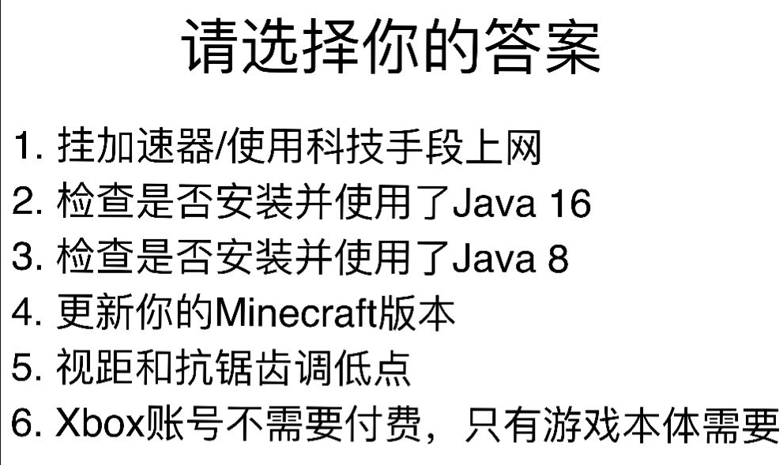

# 如何正确地请求别人的帮助？

如果您不经常上网与他人交流或您不善于和他人交流，但是您又想询问别人问题您应该查看[《如何正确并且聪明地提问》](https://github.com/ryanhanwu/How-To-Ask-Questions-The-Smart-Way/blob/main/README-zh_CN.md)一文，您可以`"从使用有意义且描述明确的标题"`这章开始阅读，`"在提问之前"`也极为重要；相信我，这对您的人际交往有很大作用，并且没有人会因为您在阅读这个而耻笑您

## 需要注意

这些是比较常见的问题，常见到他可能不会写在BakaXL帮助文档中

需要注意的是，BakaXL及其用户一般只会帮助解决与BakaXL有关的错误（如无法启动游戏），因其他问题导致的错误可能会无从定位。 在这种情况下，我们推荐您通过下面这些搜索引擎尝试搜寻到答案

之后，当您请求别人帮助时，请务必清楚自己的问题并且让他人明确了解您的问题是什么，下面这些图也并非空穴来风

